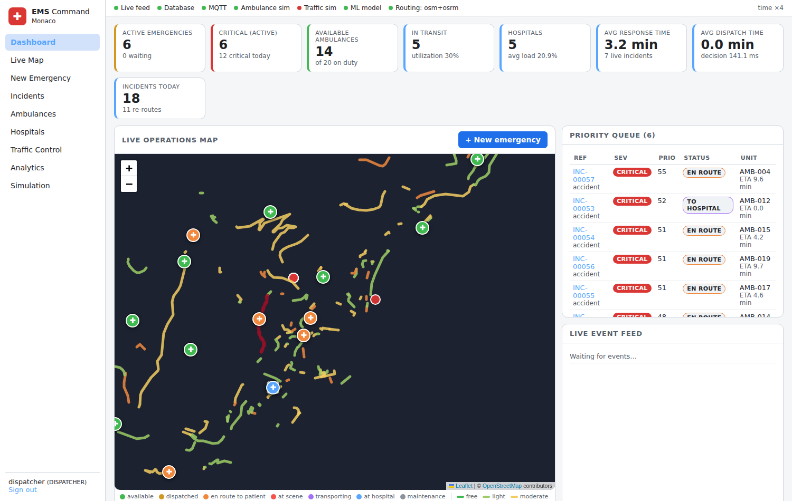
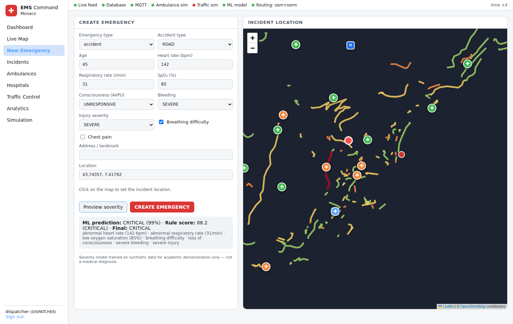
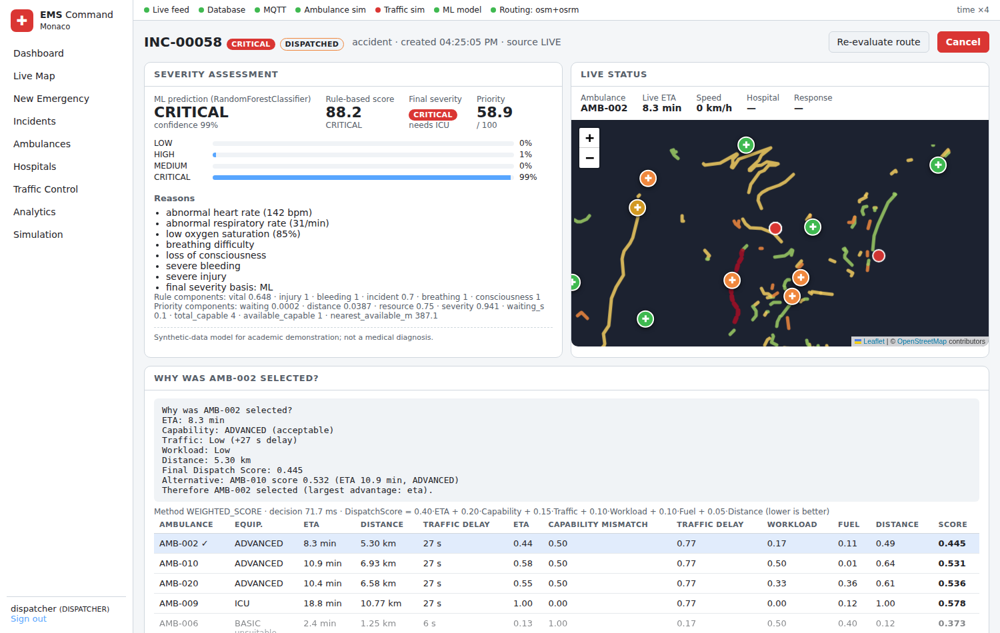
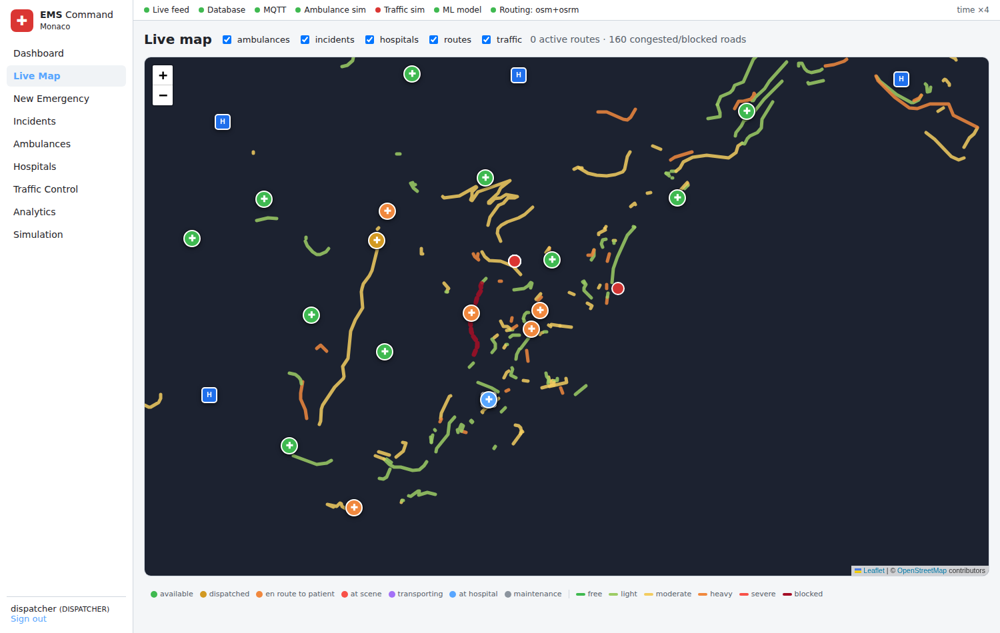
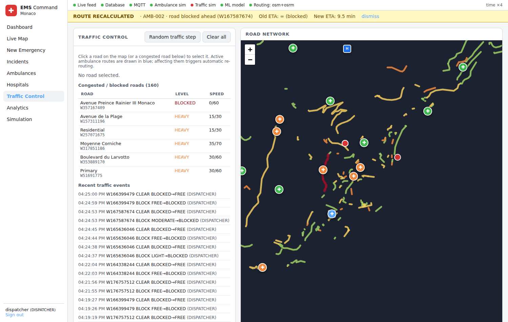
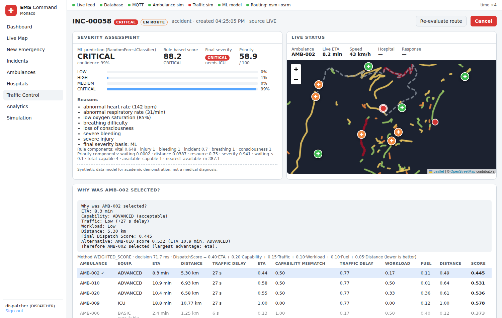
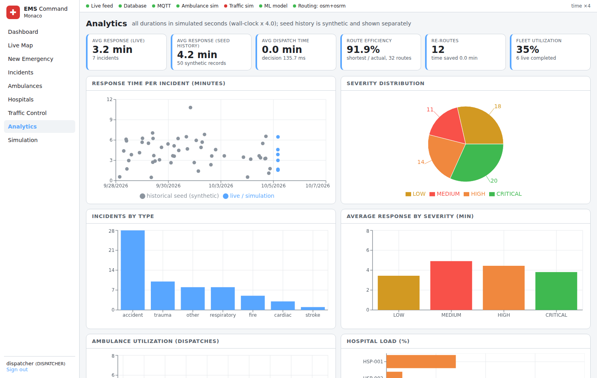

# AI-Powered Emergency Vehicle Dispatch & Traffic-Aware Routing System

A working, locally-runnable emergency response command center: emergencies are classified by a
trained ML model plus a transparent rule score, prioritised in a queue, matched to the best ambulance
by a multi-criteria optimiser over **traffic-aware road routes**, tracked live over **MQTT → PostGIS →
WebSocket**, re-routed automatically when simulated traffic degrades the current route, and delivered
to the most suitable hospital. Every number in the UI is computed by the backend and stored in
PostgreSQL/PostGIS.

> **Academic project.** Traffic and GPS are *simulated*; the severity model is trained on a *synthetic*
> dataset and is **not** a medical device and does not provide diagnoses. See [Limitations](#21-limitations).

---

## Contents
1. [Problem statement](#1-problem-statement) · 2. [Motivation](#2-motivation) · 3. [Objectives](#3-objectives) ·
4. [Features](#4-features) · 5. [Architecture](#5-architecture) · 6. [Technology stack](#6-technology-stack) ·
7. [Database](#7-database-architecture) · 8. [ML](#8-ml-architecture) · 9. [Routing](#9-routing-architecture) ·
10. [Traffic simulation](#10-traffic-simulation) · 11. [Dispatch algorithm](#11-dispatch-algorithm) ·
12. [Formulas](#12-formulas) · 13. [Installation (Windows)](#13-installation-windows-powershell) ·
14. [Running](#14-running-the-project) · 15. [Docker](#15-option-b-docker-compose) · 16. [Demo](#16-demo-scenario) ·
17. [API](#17-api) · 18. [Testing](#18-testing) · 19. [Measured results](#19-measured-results) ·
20. [Screenshots](#20-screenshots) · 21. [Limitations](#21-limitations) · 22. [Future work](#22-future-work)

---

## 1. Problem statement
Dispatching the *geographically nearest* ambulance is often wrong: the nearest unit may lack the
equipment the patient needs, be stuck behind an accident, be low on fuel or already overworked, and
the nearest hospital may have no ICU or cardiac unit. The best decision depends on **severity, travel
time under current traffic, unit status and capability, road closures, workload, hospital
capability and hospital load**, and it must be re-evaluated as conditions change.

## 2. Motivation
Every minute of response time matters for cardiac arrest, stroke and major trauma. Commercial
dispatch systems combine triage, GIS and live traffic. This project rebuilds that pipeline with free,
open-source components so each step (prediction, scoring, routing, re-routing) is inspectable.

## 3. Objectives
* Classify emergency severity with a real, evaluated ML model and an explainable rule score.
* Prioritise incidents with a priority queue instead of first-come-first-served.
* Select ambulances by a weighted multi-criteria score computed on **traffic-adjusted road ETAs**.
* Use OpenStreetMap + PostGIS + a local OSRM server for geospatial work and routing.
* Simulate IoT devices (ambulance GPS, traffic sensors, hospital capacity) over MQTT.
* Push all state changes to the browser in real time (WebSocket).
* Detect route degradation and re-route automatically; select hospitals by suitability.
* Store every decision for analytics; make every decision explainable; make simulations reproducible.

## 4. Features
| Area | What is implemented |
|---|---|
| Emergency intake | validated form/API, PostGIS `ST_Contains` service-area check, statuses `CREATED → … → COMPLETED/CANCELLED` |
| Severity | RandomForest (scikit-learn, joblib) + rule score with reasons + safety override |
| Priority | PriorityScore (severity, waiting time, distance to nearest free unit, resource scarcity) + heap queue |
| Dispatch | PostGIS KNN candidate search → route per candidate → DispatchScore → best unit; OR-Tools CP-SAT for several simultaneous incidents; manual override |
| Routing | OSM road graph in PostGIS, scipy Dijkstra on live traffic weights, local OSRM alternatives re-costed with live traffic |
| Traffic | per-road congestion level, closures, accident multiplier, vehicle density; dispatcher controls + MQTT traffic simulator |
| Re-routing | triggers: road blocked ahead, ETA +20 %, SEVERE congestion ahead, accident on route; old/new ETA and time saved stored |
| Hospitals | HospitalScore (ETA, capability mismatch, load, traffic delay), capacity updates, warnings when no suitable hospital exists |
| Live tracking | MQTT simulator → backend → batched PostGIS writes → WebSocket → Leaflet markers |
| Analytics | response/dispatch time, route efficiency, re-routes, utilisation, hospital load, severity/type distributions, ML metrics |
| Security | JWT (HS256), bcrypt password hashes, roles ADMIN / DISPATCHER / VIEWER |
| Simulation | seeded schedules (`seed=42` reproducible), 16-step scripted demo scenario |
| Ops | `/api/health`, structured JSON logs, Prometheus `/metrics`, Docker Compose |

## 5. Architecture
```
 React + Vite + TypeScript (Leaflet/OSM, Recharts)            Python IoT simulators
   Dashboard · Live map · Emergencies · Traffic control         ambulance_simulator.py  traffic_simulator.py
   Analytics · Simulation                                        (GPS, telemetry)        (road sensors, hospital discharges)
          │ REST /api/*        ▲ WebSocket /ws                          │  ▲ MQTT (Mosquitto broker)
          ▼                    │                                         ▼  │
 ┌──────────────────────────── FastAPI backend ─────────────────────────────────────────────┐
 │ API routers ─ services: incident · dispatch · mission · routes(reroute) · traffic ·       │
 │                         telemetry(batch) · analytics · simulation · auth                 │
 │ ML engine (RandomForest)   Dispatch engine (scores, priority queue, OR-Tools CP-SAT)     │
 │ Routing engine: RoadGraph (scipy Dijkstra, live weights) + OSRM client (local)           │
 │ background loops: telemetry flush 1 s · missions 1 s · dispatcher 3 s · route monitor 5 s │
 └─────────────────────────────────┬────────────────────────────────────────────────────────┘
                                   ▼
            PostgreSQL 16 + PostGIS 3 (geography points/lines, GIST indexes)          OSRM (Docker, car.lua, MLD)
```
Data flow for a live update: simulator publishes `ambulance/AMB-004/location` → `MqttBridge` thread →
`TelemetryBuffer` (updates route progress + remaining ETA, broadcasts `AMBULANCE_LOCATION_UPDATED`) →
flushed every second in one transaction to `ambulances` and `ambulance_locations` → map marker moves.

State changes are written with `emit()` into `system_events` **inside the same DB transaction**; the
WebSocket broadcast and MQTT publications run only after the commit succeeds
(`app/services/events.py`), so clients never see state that was rolled back.

Project layout:
```
emergency-dispatch/
├─ backend/app/
│  ├─ main.py  config.py  database.py  migrate.py  seed.py
│  ├─ api/          auth, emergencies, fleet, routes, traffic, analytics, ml, simulation, health
│  ├─ models/       SQLAlchemy/GeoAlchemy2 mappings     schemas/  Pydantic validation
│  ├─ services/     incident, dispatch, mission, routes (re-routing), traffic, telemetry, analytics, simulation, events, auth, metrics
│  ├─ ml/           dataset.py (synthetic generator) train.py predict.py artifacts/metrics.json
│  ├─ routing/      graph.py engine.py osrm_client.py traffic.py eta.py network_import.py
│  ├─ dispatch/     severity.py priority.py scoring.py optimizer.py
│  ├─ mqtt/         client.py handlers.py         websocket/manager.py     utils/
│  └─ tests/        30 pytest tests
├─ frontend/src/    pages/ components/ map/ hooks/useLive.tsx services/ types/   e2e/ (Playwright)
├─ simulator/       ambulance_simulator.py traffic_simulator.py run_simulator.py common.py
├─ database/        migrations/0001_initial.sql   seed/seed_data.py
├─ data/maps/       monaco.osm.pbf (sample) + README (your own city)
├─ scripts/         setup_windows.ps1 start_windows.ps1 setup_osrm.ps1/.sh benchmark.py
├─ docker/ monitoring/ docker-compose.yml .env.example requirements.txt
```

## 6. Technology stack
Every component has a concrete role:

| Technology | Role in this system |
|---|---|
| Python 3.11, FastAPI, Pydantic | REST + WebSocket API, request validation, OpenAPI docs at `/docs` |
| SQLAlchemy 2 + GeoAlchemy2 + psycopg 3 | ORM, transactions, row locks (`FOR UPDATE`) during dispatch |
| PostgreSQL 16 + PostGIS 3 | all persistent state; `GEOGRAPHY` points/lines; `ST_DWithin`, `ST_Distance`, `<->` KNN, `ST_Contains`, `ST_Buffer` |
| OpenStreetMap + pyosmium | road network import (ways, speeds, one-ways) |
| OSRM (Docker) | candidate routes and alternatives on the OSM network |
| numpy / scipy | vectorised edge weights, C Dijkstra (`scipy.sparse.csgraph`), KD-tree node snapping |
| scikit-learn, pandas, joblib | severity classifier training/evaluation/serving |
| Google OR-Tools (CP-SAT) | optimal multi-incident ambulance assignment |
| paho-mqtt + Mosquitto | IoT messaging between simulators and backend |
| FastAPI WebSockets | real-time push to dispatchers |
| PyJWT + bcrypt | authentication and password hashing |
| prometheus-client | `/metrics` (optional Prometheus/Grafana via compose profile) |
| React 18, TypeScript, Vite, Leaflet, Recharts | command-center UI, maps, charts |
| pytest, HTTPX/TestClient, Playwright | unit, API, integration and browser E2E tests |
| Docker Compose | Option B deployment; OSRM preprocessing |

Redis is **not** used: in-process caches (route cache, live telemetry) are sufficient at this scale,
so it was left out instead of adding an unused dependency.

## 7. Database architecture
Schema: `database/migrations/0001_initial.sql`, applied by `python -m app.migrate` (ordered SQL files
recorded in `schema_migrations`).

| Table | Purpose / key columns |
|---|---|
| `users` | UUID, username, bcrypt `password_hash`, `role` (ADMIN/DISPATCHER/VIEWER) |
| `service_areas` | `boundary GEOMETRY(POLYGON,4326)`, used with `ST_Contains` to validate incident locations |
| `road_nodes` | OSM node id, `location GEOGRAPHY(POINT)` |
| `road_conditions` | one row per road (OSM way): speed limit, `congestion_level`, `blocked`, `incident_multiplier`, `vehicle_density`, `geom GEOGRAPHY(LINESTRING)` |
| `road_edges` | directed edges between consecutive OSM nodes → `road_id`, `length_m` |
| `emergency_incidents` | UUID, `reference`, location, vitals, ML + rule results, `priority`, `status`, lifecycle timestamps, `source` |
| `ambulances` | `AMB-001`…, `location`, status, `equipment_level`, fuel, speed, `current_incident`, `missions_today` |
| `ambulance_locations` | GPS history (batched inserts) |
| `hospitals` | capacity, ICU beds, trauma/cardiac/stroke flags, `current_load`, `location` |
| `dispatches` | chosen unit, score, all candidate scores (JSONB), explanation, hospital candidates/explanation, decision time |
| `routes` / `route_segments` | every planned/re-planned route with geometry, free-flow and traffic ETA, OSRM ETA, shortest distance, re-route reason, old ETA, time saved; per-segment road and planned speed |
| `traffic_events` | every congestion change / accident / closure with source (SIMULATOR, DISPATCHER, SCENARIO, SIMULATION, SEED) |
| `iot_messages` | every MQTT message received (JSONB) |
| `model_predictions` | features, class probabilities, model version, latency per incident |
| `system_events` | append-only log of all decisions/state changes (analytics + incident timelines) |

Indexes: GIST on all geography columns; B-tree on incident status/created_at, ambulance status,
route `active` (partial), `route_segments(road_id)`, traffic event road/time, system event type/time.

PostGIS is used for real work: nearest available ambulances (`ORDER BY location <-> incident.location`),
distance to nearest free unit (`ST_Distance`) in the priority score, roads near an accident point
(`ST_DWithin` + KNN), nearest road to a map click, hospital pre-selection by KNN, service-area
containment (`ST_Contains`), and the service area itself (`ST_Buffer`).

## 8. ML architecture
`app/ml/dataset.py` → `app/ml/train.py` → `app/ml/artifacts/model.joblib` → `app/ml/predict.py` → API.

* **Dataset**: 6 000 synthetic cases (seed 42). Each case draws a latent acuity class (prior depends on
  emergency type), then class-conditional vitals and observations with overlap, plus 4 % label noise.
  *It is synthetic and medically inspired only.*
* **Features**: age, heart rate, respiratory rate, SpO₂, consciousness (AVPU 0–3), bleeding (0–3),
  injury severity (0–3), breathing difficulty, chest pain, emergency type (one-hot), accident type (one-hot).
* **Target**: LOW / MEDIUM / HIGH / CRITICAL. **Split**: 80/20 stratified (4 800 / 1 200).
* **Models compared**: Logistic Regression, Random Forest (deployed, 200 trees, depth 14, balanced),
  Gradient Boosting. Metrics are written to `artifacts/metrics.json` and shown on the Analytics page.
* **Serving**: loaded once at start-up; each prediction is stored in `model_predictions`. If the model
  file is missing the incident is marked `ml_status = UNAVAILABLE`, the rule score is used and the UI
  says so: it never pretends a prediction happened.
* **Final severity**: ML prediction, unless the rule score is ≥ 2 levels higher (safety override).

Measured on the held-out test set (synthetic data, so these numbers describe how separable the
generator is, **not** real-world clinical performance):

| Model | Accuracy | Precision (macro) | Recall (macro) | F1 (macro) |
|---|---|---|---|---|
| Logistic Regression | 0.930 | 0.936 | 0.933 | 0.934 |
| **Random Forest (deployed)** | **0.955** | **0.960** | **0.955** | **0.957** |
| Gradient Boosting | 0.959 | 0.963 | 0.960 | 0.961 |

RandomForest confusion matrix (rows = true, cols = predicted; LOW, MEDIUM, HIGH, CRITICAL):
`[[260,20,0,0],[6,363,7,0],[0,11,311,4],[0,0,6,212]]`. Most important features: SpO₂ (0.35),
heart rate (0.31), respiratory rate (0.17), consciousness (0.06).

## 9. Routing architecture
```
point → nearest road node (KD-tree) → candidates ─┬─ graph: Dijkstra on current traffic-adjusted edge times (closures removed)
                                                  └─ OSRM: up to 3 alternatives (car profile, MLD) → re-costed edge-by-edge
       → choose min traffic-adjusted duration → distance, free-flow duration, adjusted duration, geometry, segments
```
* The road graph (`road_nodes`, `road_edges`, `road_conditions`) is imported from the OSM extract with
  pyosmium and reduced to its largest strongly-connected component.
* OSRM knows nothing about our simulated traffic, so each OSRM route is mapped back onto our edges via
  OSM node ids (`annotations=nodes`) and re-costed with live speeds. Unmappable node pairs keep OSRM's
  own estimate. Both engines are always compared, and the result records which won (`routes.engine`).
* **Fallback**: no OSRM → graph only. No OSM extract → a synthetic grid network (status bar shows
  `synthetic-fallback`). Points more than 1.5 km from any road are rejected.
* Verified in this environment with the bundled Monaco extract: 11 250 nodes, 19 562 directed edges,
  1 108 roads; OSRM built with `osrm-extract/partition/customize` in Docker.

## 10. Traffic simulation
* Each road has `congestion_level ∈ {FREE, LIGHT, MODERATE, HEAVY, SEVERE, BLOCKED}`, `blocked`,
  `incident_multiplier ∈ (0,1]`, `vehicle_density`.
* **Traffic simulator** (`simulator/traffic_simulator.py`, seeded): every 5–10 s it applies a Markov
  drift to a few roads (major roads 3× more likely), creates accidents (SEVERE, multiplier 0.5) that may
  escalate to closures and clear after ~25–40 s, and publishes `traffic/{road_id}/status` (retained),
  `traffic/{road_id}/speed`, `traffic/events`. `--target-routes 0.3` aims 30 % of ticks at roads on
  active ambulance routes so that re-routing is exercised.
* **Dispatcher traffic control** (UI/API): accident, block, unblock, congestion level, clear, random
  step, clear all.
* The backend is the single source of truth: `traffic_service.apply_update()` updates PostGIS, the
  in-memory graph, `traffic_events`, MQTT (for the ambulance simulator), WebSocket, then triggers the
  route monitor.

## 11. Dispatch algorithm
1. `create_incident`: validate → `ST_Contains` → ML → rule score → final severity → required capability
   (CRITICAL→ICU, HIGH/cardiac/stroke→ADVANCED, else BASIC) → PriorityScore → `WAITING`.
2. `dispatcher_cycle` (on creation, every 3 s, after units free up): recompute priorities of waiting
   incidents, pop up to 5 from the heap-based priority queue.
3. Candidates: nearest 8 `AVAILABLE`, on-duty units with ≥ 10 % fuel by PostGIS KNN, plus the 2 nearest
   units meeting the capability requirement.
4. A traffic-aware route is computed for each candidate; the DispatchScore components are normalised
   across the candidate set; units with capability match 0 are only used if no suitable unit exists.
5. One incident → minimum score. Several incidents → **OR-Tools CP-SAT** maximises
   Σ x·(10·priority − 100·score) with one unit per incident and one incident per unit, so scarce units
   go to the highest-priority incidents. If the optimiser gives an incident a unit other than its
   individually best one, the explanation says why.
6. Commit: dispatch row (all candidates + explanation), route + segments, statuses, events; after
   commit the route is published to `ambulance/{id}/command` (retained) for the simulator.
7. Mission state machine (`mission_service`): `ROUTE_STARTED` → EN_ROUTE; `ARRIVED` → ARRIVED;
   after scene time → PATIENT_LOADED → **hospital selection** → TO_HOSPITAL; `ARRIVED` at hospital;
   after handover time → COMPLETED, unit AVAILABLE.
8. Route monitor: after every traffic change touching a road ahead (and every 5 s) it compares the
   remaining ETA at current speeds with the remaining ETA at planned speeds and re-routes from the next
   junction if a trigger fires and the alternative is faster by ≥ max(10 s, 5 %). A road closure always
   forces a new route.

## 12. Formulas
All implemented in code (file in brackets) and unit-tested.

* **Haversine** (`utils/geo.py`, fallback only): a = sin²(Δφ/2) + cos φ1·cos φ2·sin²(Δλ/2);
  c = 2·atan2(√a, √(1−a)); d = R·c, R = 6 371 000 m.
* **Base ETA** (`routing/eta.py`): ETA_base = Distance / Speed (m, m/s → s).
* **Traffic** (`routing/traffic.py`): AdjustedSpeed = SpeedLimit × CongestionFactor × IncidentMultiplier,
  factors FREE 1.00 · LIGHT 0.85 · MODERATE 0.70 · HEAVY 0.50 · SEVERE 0.30 · BLOCKED 0;
  ETA_adjusted = Distance / AdjustedSpeed (∞ when blocked). Route ETA = Σ segment times.
* **Route efficiency**: ShortestPossibleDistance / ActualRouteDistance (shortest = network shortest
  path by length, ignoring traffic).
* **Time saved**: OldETA − NewETA (OldETA = remaining ETA on the degraded route).
* **Degradation**: (current remaining ETA − planned remaining ETA) / planned; re-route trigger > 0.20.
* **SeverityScore** (`dispatch/severity.py`) = 100 × (0.25·Vital + 0.20·Consciousness + 0.20·Breathing +
  0.15·Bleeding + 0.10·Injury + 0.10·Incident); 0–25 LOW · 26–50 MEDIUM · 51–75 HIGH · 76–100 CRITICAL.
  An engineering prioritisation heuristic, **not** a validated clinical score.
* **PriorityScore** (`dispatch/priority.py`) = 100 × (0.50·Severity + 0.20·TimeWaiting +
  0.15·DistanceToPatient + 0.15·ResourceUrgency), with Severity = 0.5·level + 0.5·rule/100,
  TimeWaiting = min(1, wait/600 s), Distance = min(1, nearest free unit / 10 km),
  ResourceUrgency = 1 − available capable units / total capable units.
* **DispatchScore** (`dispatch/scoring.py`, lower is better) = 0.40·ETA + 0.20·Capability + 0.15·Traffic +
  0.10·Workload + 0.10·Fuel + 0.05·Distance, where ETA = eta/max eta, Capability = 1 − match
  (match 1.0 perfect, 0.5 acceptable, 0 unsuitable), Traffic = delay/max delay, Workload = min(1, missions/6),
  Fuel = 1 − fuel/100, Distance = distance/max distance.
  (The specification lists capability as "1.0 = perfect", but the score is minimised, so the code uses
  the *mismatch* 1 − match. Otherwise a perfect match would be penalised.)
* **HospitalScore** (lower is better) = 0.45·ETA + 0.25·CapabilityMismatch + 0.15·CapacityLoad +
  0.15·TrafficDelay; mismatch = unmet requirements / requirements (ICU for CRITICAL, trauma for severe
  accident/trauma/fire, cardiac, stroke); full hospitals are ranked last.

## 13. Installation (Windows PowerShell)
Prerequisites (all free): **Python 3.11+**, **Node.js 20+**, **PostgreSQL 16 with PostGIS**,
**Mosquitto**, and **Docker Desktop** (only for OSRM / Option B).

```powershell
# 1) PostgreSQL + PostGIS
winget install PostgreSQL.PostgreSQL.16
#    then run "Application Stack Builder" (installed with PostgreSQL) → Spatial Extensions → PostGIS 3.x
#    Create the databases (password = the one chosen during installation; .env assumes "postgres"):
& "C:\Program Files\PostgreSQL\16\bin\psql.exe" -U postgres -c "CREATE DATABASE ems;"
& "C:\Program Files\PostgreSQL\16\bin\psql.exe" -U postgres -c "CREATE DATABASE ems_test;"

# 2) Mosquitto MQTT broker (runs as a Windows service on port 1883)
winget install EclipseFoundation.Mosquitto
Start-Service mosquitto

# 3) Project (from the emergency-dispatch folder)
Copy-Item .env.example .env          # edit DATABASE_URL password, JWT_SECRET, CITY_* if needed
python -m venv .venv
.\.venv\Scripts\Activate.ps1
pip install -r requirements.txt
cd backend
python -m app.ml.train               # trains + evaluates the models, writes app/ml/artifacts/
python -m app.migrate                # creates the PostGIS schema
python -m app.seed                   # road network, users, 20 ambulances, 5 hospitals, 50 historical incidents
cd ..\frontend
npm install
cd ..
```
`scripts\setup_windows.ps1` performs step 3 in one go. Without an OSM extract, the seed generates the
synthetic fallback network around `CITY_LAT/CITY_LON` (default Bengaluru). For real roads:

```powershell
# Real map data: bundled Monaco sample …
#   in .env: CITY_NAME=Monaco  CITY_LAT=43.7384  CITY_LON=7.4246  CITY_RADIUS_M=5000  OSM_PBF_PATH=../data/maps/monaco.osm.pbf
# … or your own city (see data\maps\README.md for downloading a small extract)
cd backend; python -m app.seed --reset-network; cd ..

# OSRM (Docker Desktop):
.\scripts\setup_osrm.ps1 -Pbf data\maps\monaco.osm.pbf
docker run -d --name osrm -p 5000:5000 -v "${PWD}\data\maps:/data" osrm/osrm-backend osrm-routed --algorithm mld /data/monaco.osrm
#   set OSRM_URL=http://localhost:5000 in .env (leave empty to use only the built-in graph router)
```

Development accounts created by the seed (change for anything beyond local use):
`admin / admin123` (ADMIN), `dispatcher / dispatch123` (DISPATCHER), `viewer / viewer123` (VIEWER).

## 14. Running the project
Three terminals (PostgreSQL and Mosquitto already running), or `.\scripts\start_windows.ps1`:
```powershell
# Terminal 1 - backend (REST, WebSocket, MQTT consumer, background workers)
cd backend; ..\.venv\Scripts\Activate.ps1; uvicorn app.main:app --port 8000

# Terminal 2 - IoT simulator (ambulance GPS + dynamic traffic + hospital discharges)
.\.venv\Scripts\Activate.ps1; python simulator\run_simulator.py --target-routes 0.2
#   ambulances only (traffic changed only by you / the scenario):  python simulator\run_simulator.py --no-traffic

# Terminal 3 - frontend
cd frontend; npm run dev
```
Open **http://localhost:5173** (UI) · **http://localhost:8000/docs** (OpenAPI) ·
**http://localhost:8000/api/health** · **http://localhost:8000/metrics**.

The status bar shows the live connection state of the WebSocket, database, MQTT, both simulators, the ML
model and the routing mode. Simulated time runs `SIM_TIME_SCALE` (default 4) × faster than wall-clock.
All durations shown are simulated seconds.

## 15. Option B: Docker Compose
```powershell
Copy-Item .env.example .env
docker compose up --build                                   # postgres+postgis, mosquitto, backend, simulator, frontend
docker compose --profile osrm up -d osrm                    # after running scripts\setup_osrm.ps1 (OSRM_DATASET=monaco)
docker compose --profile monitoring up -d                   # Prometheus :9090, Grafana :3000 (optional)
```
UI at http://localhost:5173. Inside compose, set `DOCKER_OSRM_URL=http://osrm:5000` to enable OSRM.
Verification status in the development sandbox: the **backend image** (`backend/Dockerfile`, also used
by the simulator service) was built, including the model-training step, and the container started healthy
against PostGIS/Mosquitto/OSRM (`/api/health` → `ok`, `osm+osrm`). The OSRM container commands were also
run. The complete `docker compose up` and the frontend image were **not** run there: the sandbox's
TLS-intercepting proxy blocks package downloads inside image builds. Run them on your machine.

## 16. Demo scenario
UI: **Simulation → Run demo scenario** (or `POST /api/simulation/demo-scenario`). Requires the
ambulance simulator. Steps, all executed by the real system:

1. all units but three set OFFLINE (nearest BASIC, ADVANCED and ICU units 1.2–4 km away)
2. a critical road accident is created → 3. ML predicts CRITICAL, rule score shown
4. the three candidates are routed and scored → 5. the best unit is dispatched (not necessarily the nearest)
6. the unit moves (MQTT) → 7. an accident is injected on a road ahead on its route
8–11. the route monitor detects the degradation and computes and selects the alternative
(if SEVERE congestion still leaves no faster detour, the road is then closed and the forced re-route is shown)
12. arrival → 13. hospital selection with explanation → 14. transport → 15. completion → 16. analytics.

Recorded run in the dev environment (Monaco OSM + OSRM, seed 42, time scale 4):
ML CRITICAL (0.99), rule score 97.0; AMB-014 (ICU) chosen, ETA 5.4 min; accident on road `W317837860`
→ **ROUTE RECALCULATED: old ETA 6.3 min → new ETA 5.8 min, time saved 0.5 min**; hospital
"City General Hospital (synthetic)"; completed after 257 s wall-clock.

**Simulation mode** (UI Simulation → START SIMULATION): `seed=42`, 10 ambulances, 5 hospitals,
20 incidents, 30 traffic events spread over `duration_s`. The schedule is deterministic per seed
(`GET /api/simulation/schedule-preview?seed=42` returns identical events every time).

Manual demo: create an emergency on the map → watch the details page (candidate table, explanation,
live ETA) → Traffic Control → click a road on the blue route → *Block road* → the yellow
"ROUTE RECALCULATED" banner shows old/new ETA.

## 17. API
Interactive docs: `/docs`. All endpoints except login/health require `Authorization: Bearer <JWT>`.

| Method | Path | Role | Description |
|---|---|---|---|
| POST | `/api/auth/login` | – | JWT login |
| GET | `/api/auth/me` · `/api/users` · POST `/api/users` | any · ADMIN | current user, user management |
| POST | `/api/emergencies` | DISPATCHER | create (ML + rule + priority, auto-dispatch by default) |
| GET | `/api/emergencies` `?active=&status=&source=` | any | list |
| GET | `/api/emergencies/{id}` | any | details: dispatch decision, routes, prediction, timeline, live ETA |
| POST | `/api/emergencies/{id}/dispatch` `{ambulance_id?}` | DISPATCHER | dispatch now (optional manual override) |
| GET | `/api/emergencies/{id}/candidates` | any | candidate evaluation preview |
| POST | `/api/emergencies/{id}/reroute` · `/cancel` | DISPATCHER | re-evaluate route · cancel |
| GET | `/api/ambulances` `?status=&near_lat=&near_lon=&radius_m=` · `/{id}` | any | fleet (PostGIS `ST_DWithin` filter), track |
| POST/PATCH | `/api/ambulances` · `/{id}` | ADMIN | manage units |
| GET/POST/PATCH | `/api/hospitals` | any / ADMIN | hospitals |
| GET | `/api/routes` `?active=` · `/api/routes/{id}` | any | routes with segments |
| POST | `/api/routes/calculate` | any | traffic-aware route between two points |
| GET | `/api/traffic/roads` · `/roads/nearest` · `/events` · `/network` | any | road states/geometry, events, graph stats |
| POST | `/api/traffic/events` | DISPATCHER | ACCIDENT · BLOCK · UNBLOCK · CONGESTION(level) · CLEAR by road or point |
| POST | `/api/traffic/simulate` · `/api/traffic/reset` | DISPATCHER | random traffic step(s) · clear all |
| GET | `/api/analytics/summary` · `/response-times` · `/breakdowns` · `/reroutes` | any | analytics |
| GET/POST | `/api/ml/model` · `/api/ml/predict` | any | metrics · predict without creating an incident |
| POST | `/api/simulation/start` · `/demo-scenario` · `/stop` · `/reset`; GET `/status` · `/schedule-preview` | DISPATCHER / any | simulation |
| GET | `/api/health` · `/metrics` | – | component health (503 if DB/graph down) · Prometheus |
| WS | `/ws?token=<JWT>` | any | events: `AMBULANCE_LOCATION_UPDATED`, `AMBULANCE_STATUS_CHANGED`, `EMERGENCY_CREATED`, `EMERGENCY_STATUS_CHANGED`, `EMERGENCY_PRIORITY_CHANGED`, `EMERGENCY_CLASSIFIED`, `DISPATCH_CREATED`, `ROUTE_RECALCULATED`, `ROUTE_CHECK`, `TRAFFIC_CHANGED`, `HOSPITAL_SELECTED`, `HOSPITAL_CAPACITY_CHANGED`, `HOSPITAL_WARNING`, `INCIDENT_COMPLETED`, `SIMULATION_STATUS` |

MQTT topics: `ambulance/{id}/location|status|telemetry|command`, `traffic/{road_id}/status|speed`,
`traffic/events`, `emergency/{id}/created|status`, `hospital/{id}/capacity`, `simulator/heartbeat`.

## 18. Testing
```powershell
# backend: 30 tests (wipes and recreates TEST_DATABASE_URL, default database ems_test)
cd backend; python -m pytest

# frontend E2E (backend on :8000 and `npm run dev` running; simulator optional)
cd frontend; npx playwright install chromium; npx playwright test
```
* `test_formulas.py`: Haversine, congestion factors, adjusted speed, ETA, efficiency, time saved,
  severity score/levels/reasons, safety override, priority score and queue, DispatchScore (exact value),
  unsuitable-candidate handling, HospitalScore (capability beats proximity).
* `test_routing.py`: route selection on a hand-built network reacting to SEVERE and BLOCKED roads,
  remaining-ETA maths, OR-Tools assignment (priority first, global optimum, capability constraint).
* `test_ml.py`: deterministic dataset, model loading/prediction, metrics report.
* `test_api.py`: health, login/RBAC, validation (bad coordinates, outside service area), create →
  retrieve → candidates → dispatch → cancel, "no available ambulance" error, traffic events change
  routes, analytics, ML endpoint, deterministic simulation schedule, WebSocket auth + streaming,
  zero-length route regression.
* `test_integration.py`: full workflow emergency → severity → selection → route → dispatch → movement
  → road closure → automatic re-route → arrival → hospital → completion → analytics; OR-Tools batch dispatch.
* `frontend/e2e/dispatch.spec.ts`: login (bad + good), create emergency via form and map click, see
  dispatch explanation, see the ambulance marker on the map, traffic event → re-route banner and route
  table, analytics, viewer is read-only.

Last run in the development environment: **backend 30 passed**, **Playwright 3 passed**.

## 19. Measured results
Measured in the development container (Linux, 4 vCPU, Python 3.11) on the Monaco OSM network
(11 250 nodes / 19 562 edges) with a local OSRM server. Raw output: [`docs/benchmark.json`](docs/benchmark.json).
Re-measure on your machine with `python scripts\benchmark.py` (it writes test rows; re-seed afterwards).

| Operation | Median | p95 |
|---|---|---|
| Traffic-aware graph route (snap + Dijkstra + segment build) | 1.35 ms | 1.83 ms |
| Full route incl. OSRM alternatives + re-costing | 5.15 ms | 10.69 ms |
| ML severity prediction (RandomForest, 1 case) | 9.82 ms | 10.16 ms |
| DispatchScore for 100 candidates | 0.17 ms | 0.19 ms |
| Telemetry: ingest + flush 100 GPS fixes to PostGIS | 5.97 ms | 11.4 ms |

Seeded simulation run (seed 42, 10 ambulances, 5 hospitals, 20 incidents within 2 minutes,
30 scheduled traffic events + live traffic simulator; details in
[`docs/simulation_run.json`](docs/simulation_run.json)): all **20/20 incidents completed** with no backend
errors. There were **6 automatic re-routes saving 305 simulated seconds** in total, 9 dispatches via the
OR-Tools batch assignment, average route efficiency 0.961, and an average dispatch decision time of 59.7 ms.
The average response time (1 021 simulated s) includes queueing, because 20 incidents competed for 10 units.

## 20. Screenshots
Captured by the Playwright E2E test (`docs/screenshots/`). Map tiles are blank in these captures
because the sandbox could not reach the OSM tile server; on a normal machine the OSM base map shows.

| | |
|---|---|
|  |  |
|  |  |
|  |  |
|  | |

## 21. Limitations
* **Traffic is simulated** (Markov model + scripted/dispatcher events). It is not obtained from
  proprietary real-time traffic APIs.
* **The medical severity model is educational and not clinically validated.** It is trained on synthetic
  data; its accuracy describes the synthetic generator only. It does not predict survival, does not
  diagnose, and must not be used for real triage.
* **Ambulance GPS is simulated**; ambulances drive at the traffic-adjusted road speed (no lights-and-sirens
  model, no intersections/turn penalties beyond OSRM's own).
* OSM/OSRM represent the road network, not live road conditions; OSM speed limits are often missing and
  replaced by per-road-class defaults.
* **Synthetic data** everywhere: incidents, hospitals (names marked "synthetic"), fleet, history.
* The weighted scores are engineering choices; they do not guarantee the fastest possible response.
* Single backend process; dispatch serialisation uses an in-process lock plus row locks, which suits one
  instance (horizontal scaling would need a distributed lock/queue).
* The ambulance simulator restarts a route from its start if the simulator itself is restarted mid-route.

## 22. Future work
* Real traffic feeds (open city data / probe vehicles) and travel-time prediction (e.g. gradient boosting
  per road and time of day); OSRM `--segment-speed-file` updates for traffic-aware OSRM itself.
* Demand forecasting and proactive ambulance repositioning (coverage optimisation with OR-Tools).
* Turn-by-turn instructions, lights-and-sirens speed model, multi-patient incidents.
* Calibrated clinical scores (e.g. NEWS2) in place of the synthetic model, with clinician input.
* Redis/Kafka event bus for multiple backend instances; mobile crew app; offline-capable PWA.

---

## Resume bullet points
* Built a full-stack emergency dispatch system (FastAPI, React/TypeScript, PostgreSQL/PostGIS) that
  assigns ambulances by a multi-criteria score over traffic-adjusted OpenStreetMap routes instead of
  straight-line proximity, with explanations for every decision.
* Implemented traffic-aware routing combining a scipy-Dijkstra road graph with live edge weights and a
  locally hosted OSRM server whose alternatives are re-costed per edge; automatic re-routing on closures,
  accidents or >20 % ETA degradation, recording old/new ETA and time saved.
* Trained and evaluated a scikit-learn severity classifier (RandomForest, 0.955 accuracy / 0.957 macro-F1
  on a held-out synthetic test set) alongside a transparent rule-based score with a safety override.
* Designed an IoT pipeline: Python MQTT simulators (ambulance GPS, traffic sensors) → Mosquitto →
  backend → batched PostGIS writes → WebSocket push to a Leaflet command-center UI.
* Used Google OR-Tools CP-SAT to assign multiple simultaneous incidents globally by priority; PostGIS
  KNN/`ST_DWithin`/`ST_Contains` for candidate search and validation.
* Added JWT/RBAC, structured logging, Prometheus metrics, Docker Compose, 30 pytest tests (unit, API,
  integration) and Playwright E2E tests; reproducible seeded simulations.

## Interview questions & answers (based on this implementation)
**Q: Why not just send the nearest ambulance?**
A: Nearest by straight line ignores roads, traffic and capability. We route every candidate and score
ETA (40 %), capability mismatch (20 %), traffic delay (15 %), workload, fuel and distance. In the recorded
demo, the nearest unit was BASIC and unsuitable for a CRITICAL patient, so the ICU unit was chosen.

**Q: How does traffic affect routing if OSRM is static?**
A: Two candidate sources. Our own graph is Dijkstra-routed on *current* edge times (length /
(limit × congestion factor × incident multiplier)), with blocked roads removed. OSRM alternatives are
mapped back to our edges via OSM node ids and re-costed with the same live speeds. The lowest adjusted
ETA wins, and the route records which engine produced it.

**Q: When exactly does re-routing happen?**
A: After every traffic change on a road ahead of an active ambulance, plus a periodic 5 s check. Triggers
are: closure ahead, accident ahead, SEVERE congestion ahead, or remaining ETA more than 20 % above the
planned remaining ETA. The alternative starts at the next junction (the ambulance finishes its current
edge) and is accepted only if it is faster by at least max(10 s, 5 %), except for closures. Rejected
alternatives are logged as `ROUTE_CHECK KEEP_CURRENT` and the baseline is updated to avoid flapping.

**Q: How do you keep the database, map and simulator consistent?**
A: All state changes go through services in one DB transaction. Events are queued on the SQLAlchemy
session and broadcast/published in an `after_commit` hook, and dropped on rollback. The backend is
the traffic authority: simulator observations are applied through the same `apply_update()`, then
re-published retained on MQTT so the ambulance simulator drives at the same speeds the backend assumes.

**Q: How does the system cope with 100 ambulances sending GPS every second?**
A: Fixes are applied in memory immediately (WebSocket push, route progress, ETA). They are written to
PostGIS once per second as one batched `UPDATE` + `INSERT`. Graph routing uses scipy's C Dijkstra and
cached CSR matrices that are invalidated only when traffic changes.

**Q: Why is the ML accuracy so high? Is it overfitting?**
A: The data is synthetic, so the accuracy measures how separable my generator is, not clinical validity.
It is reported on a stratified 20 % hold-out with all three models compared. The rule score is shown
next to the prediction, and a large disagreement escalates the case.

**Q: What happens if a component is down?**
A: No ML model → `ml_status=UNAVAILABLE` and the rule score is used, visibly. OSRM down → circuit breaker,
graph router only. MQTT down → status bar red, dispatch still works but units do not move. Database or
graph down → `/api/health` returns 503. No unit available → HTTP 409 with a clear message, and the incident
stays WAITING in the priority queue until a unit frees up.

**Q: Why OR-Tools if you already have a score?**
A: With several waiting incidents, greedy per-incident choice can give the best unit to a less urgent
case. CP-SAT maximises Σ(10·priority − 100·score) with one-to-one constraints, which serves high-priority
incidents first when units are scarce. A test (`test_ortools_assignment_serves_high_priority_first`) shows
a case where the global optimum differs from greedy.

**Q: How is the simulation reproducible?**
A: Schedules are generated from `random.Random(seed)` and the dataset generator from
`numpy.random.default_rng(seed)`. The same seed yields identical incidents and traffic events, which a
test asserts. Wall-clock timing still varies slightly with machine load.
